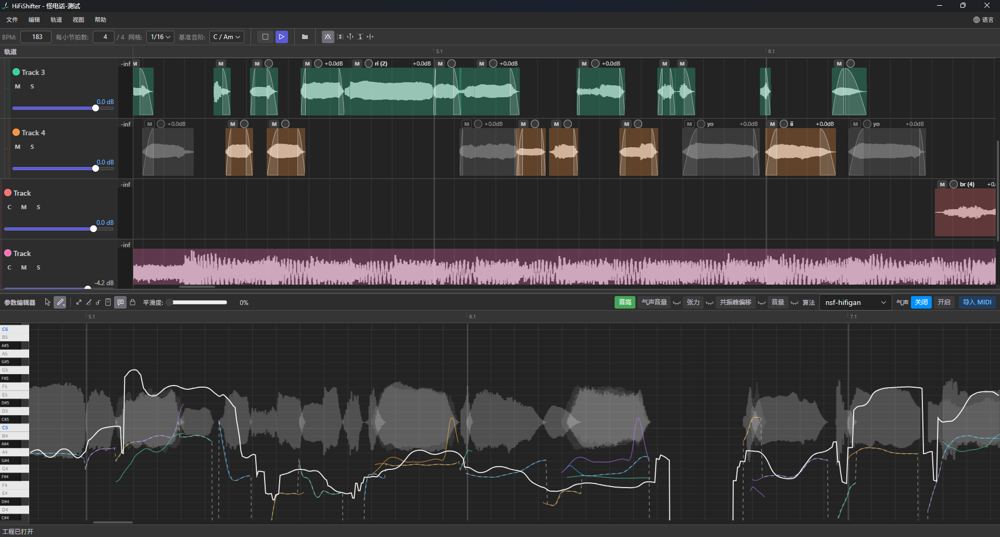

# HiFiShifter

[简体中文](README.md) | [繁體中文](docs/i18n/README_zh-TW.md) | [English](docs/i18n/README_en.md) | [日本語](docs/i18n/README_ja.md) | [한국어](docs/i18n/README_ko.md)

HiFiShifter 是一个图形化人声编辑与合成工具。它支持多轨道音频块处理，并以轨道组为单位，使用多种声码器完成人声修音、人力调参功能，实现人力VOCALOID制作的拼调一体化。

**当前项目仍在开发迭代中，未对全链路进行测试，可能存在诸多 BUG 或不稳定问题。**



## 安装

请直接在仓库侧边选择适合自己系统的Release版本下载安装

## 基本原理

HiFiShifter 使用类似 UTAU 的离线渲染方式，对时间线中的每个音频块进行处理、渲染、缓存，最后再输入到播放系统中，因此其对短音频块有着更快的处理效率。

HiFiShifter 提供了一个统一的渲染接口，以便未来增添更多的算法支持。

## 工作流推荐

我们推荐的工作流是：

1. 通过其他 DAW 或切片软件准备好人力所需的短切片音源
2. 在 HiFiShifter 中完成音频的拼贴和调音

当然，HiFiShifter 也支持以下操作方便从其他软件的工程迁移：

1. 直接打开 VocalShifter 工程
2. 直接打开 Reaper 工程
3. 解析 VocalShifter 剪贴板内容，支持将 VocalShifter 中的参数粘贴到 HiFiShifter 参数区中。
4. 解析 Reaper 剪贴板内容，支持直接将 Reaper 的 Items 粘贴到 HiFiShifter 中

## 功能介绍

### 布局介绍

HiFiShifter 可以大致的分为两个功能区，分别是上部的轨道面板和下部的参数面板。轨道面板主要负责音频块的编辑与编排，参数面板则负责对音频进行调参处理。

### 轨道面板

HiFiShifter 提供了一个基本完备的轨道面板与音频块编辑功能。该功能与大多数现代 DAW 类似。

#### 媒体导入（音频 / 视频）

HiFiShifter 支持三种方式导入媒体文件。视频文件会自动读取其中的音频轨：

1. 直接从系统文件管理器中拖拽音频或视频文件到轨道上
2. 点击工具栏的文件夹图标，打开内置文件管理器并拖拽媒体文件到轨道上
3. 按下 `Ctrl + F` 打开快捷搜索，选择媒体文件导入到轨道上（快捷搜索的文件路径与内置文件管理器的当前路径一致）

#### 音频编辑

- **吸附网格**：音频块移动/裁剪默认吸附网格；按住 `Shift` 可临时关闭吸附。
- **裁剪/伸缩范围**：拖动音频块左右边界进行裁剪或延长
- **伸缩（Time Stretch）**：按住 `Alt` + 鼠标左键拖动音频块左右边界，可伸缩音频。
- **内部偏移（Slip-Edit）**：按住 `Alt` + 鼠标左键拖动音频块主体，可左右滑移音频块的内部内容。
- **淡入淡出**：拖动音频块左上角/右上角调整淡入/淡出时长。
- **增益（dB）**：拖动音频块左上角的旋钮（上下拖动）调整增益，音频块右上角会显示当前 dB。
- **音频块静音（M）**：音频块左上角 `M` 按钮可对该音频块静音，静音后音频块整体变灰。
- **框选多选**：在时间线空白处按住鼠标右键拖拽可框选多个音频块。
- **复制拖动**：按住 `Ctrl` 后拖拽音频块，会在目标位置创建副本并保持原音频块不动（复制完成在松手时生效）。
- **胶合**：右键音频块打开菜单，选择"胶合"（要求同一轨道且至少 2 个音频块）。
- **切分**：选中音频块后按 `S` 可在播放头位置切分。
- **复制粘贴**：选中音频块后按 `Ctrl + C` 将选中音频块复制到应用内剪贴板。`Ctrl + V` 会把“所选音频块中最靠左的起点”对齐到播放头位置，其余音频块保持相对间距。复制时剪贴板会同时写入 REAPERMedia 格式，可直接在 REAPER 中粘贴。

需要特别注意的，轨道支持嵌套，可以将轨道拖动到另一个轨道下成为该轨道的子轨道，形成一个轨道组。在接下来的调参过程中，轨道组将十分有用。

### 参数面板

HiFiShifter 的参数面板提供了类似 VocalShifter 的操作支持以方便用户调整参数。

需要注意的是，HiFiShifter 的轨道上有一个特殊的 `C` 按钮，只有按下这个按钮，该轨道上的音频才能被后续调参处理。

在调参中，HiFiShifter 以轨道组为单位，通过根轨道开启 `C` 来决定，一个轨道组共用一个算法和一套参数线。参数线会按位置作用到每一个音频块上。

HiFiShifter 中的每个算法都有不同的参数可供调整，其中通用参数为音高。

在首次打开时，HiFiShifter 需要一些时间对音频块的音高进行分析。分析完成后，面板中的实线表示该轨道组的整体当前音高，虚线表示整体原始音高，彩线表示每个音频块自己的原始音高。

其他面板与音高面板类似，只是不会显示音频块自己的原始音高。

面板旁边的小眼睛可以开启该面板在未选中下的可见性。

### 算法

目前 HiFiShifter 支持三种算法进行处理。

#### World 算法

老牌声码器  
仅支持`音高`编辑

#### PC-NSF-HIFIGAN

OpenVPI 开源的为歌声特化的 hifigan 声码器  
支持 `音高`、`气声`、`张力`、`共振峰`、`音量` 参数的编辑  
需要注意的是，气声的编辑需要额外开启，将会使用 hnsep 的 UVR 模型对音频块进行气声分离，首次需要较长的时间处理。如果需要编辑张力请务必开启气声。

#### Vslib

VocalShifter 提供的算法库。
支持 `音高`、`声像`、`共振峰`、`音量`、`气声` 参数的编辑  
由于官方提供的 dll 仅支持文件IO，因此相对 VocalShifter 本体需要更多的时间处理。

## 常用快捷键速查

| 操作                           | 快捷键 / 鼠标                     |
| :----------------------------- | :-------------------------------- |
| 平移视图（时间轴）             | 鼠标中键拖动                      |
| 横向缩放（时间轴）             | 鼠标滚轮（以光标为中心）          |
| 纵向缩放（轨道高度，时间轴）   | Ctrl + 鼠标滚轮                   |
| 纵向缩放（参数轴，参数面板）   | Ctrl + 鼠标滚轮（参数面板内）     |
| 播放/暂停                      | Space（空格）                     |
| 播放/停止                      | Enter                             |
| 撤销/重做                      | Ctrl + Z / Ctrl + Y               |
| 新建工程                       | Ctrl + N                          |
| 打开工程                       | Ctrl + Shift + O                  |
| 保存                           | Ctrl + S                          |
| 另存为                         | Ctrl + Shift + S                  |
| 导出音频                       | Ctrl + E                          |
| 模式切换（选择/绘制）          | Tab                               |
| 删除选中音频块                 | Delete                            |
| 复制选中音频块（应用内剪贴板） | Ctrl + C                          |
| 粘贴到播放头位置               | Ctrl + V                          |
| 编组 / 解组                    | G / U                             |
| 循环切换 Take                  | T（`Shift + T` 切换上一个）       |
| 参数面板复制选区曲线           | Ctrl + C（Select 模式）           |
| 参数面板粘贴到选区起点         | Ctrl + V（Select 模式）           |
| 分割音频块                     | S（在播放头位置分割选中的音频块） |
| 新建轨道                       | Ctrl + T                          |
| 快速搜索                       | Ctrl + F                          |

## 开发环境配置

该部分内容为开发者提供，普通用户可以跳过。

### 1. 克隆仓库

```bash
git clone https://github.com/ARounder-183/HiFiShifter.git
cd HiFiShifter
```

### 2. 安装依赖

#### Windows

请确保已安装以下工具：

- **Node.js**（建议 18+）及 npm
- **Rust 工具链**（参见 `rust-toolchain.toml`）
- **Tauri 2 CLI**：`cargo install tauri-cli --version "^2"`
- **CMake**（用于编译 SoundTouch 库）

ONNX Runtime (DirectML) 由 ort crate 在编译时自动下载，无需额外配置。

安装前端依赖：

```bash
npm --prefix frontend install
```

#### macOS

```bash
chmod +x ./scripts/install_deps_macos.sh
SKIP_FRONTEND=0 bash ./scripts/install_deps_macos.sh
```

#### Linux

请确保已安装以下工具：

- **Node.js**（建议 20+）及 npm
- **Rust 工具链**（参见 `rust-toolchain.toml`，项目会自动选择对应平台的 stable 工具链）
- **Tauri 2 CLI**：`cargo install tauri-cli --version "^2"`
- **CMake**、**pkg-config** 及系统构建工具
- **GTK3、WebKit2GTK、ALSA** 等 Tauri 运行时开发库（详见安装脚本）

运行一键安装脚本：

```bash
chmod +x ./scripts/install_deps_linux.sh
bash ./scripts/install_deps_linux.sh
```

脚本会自动安装系统依赖、Node.js（如未安装）、appimagetool 及前端 npm 依赖。

安装前端依赖（如未使用脚本）：

```bash
npm --prefix frontend ci
```

#### Linux AppImage 构建

由于 `vslib` 算法仅限 Windows，Linux 构建需要禁用默认 feature：

```bash
# 进入 backend 目录运行（tauri.conf.json 中路径相对于此目录）
cd backend
cargo tauri build --bundles appimage -- --no-default-features --features onnx
```

或使用提供的辅助脚本：

```bash
bash scripts/build-linux-appimage.sh
```

> **注意：** WSL2 环境下因缺少 FUSE 支持，Tauri bundler 的 linuxdeploy 步骤可能失败（错误：`failed to run linuxdeploy`）。这是 WSL2 已知限制，不影响实际 AppImage 产出——AppDir 已正确组装在 `target/release/bundle/appimage/` 中。可设置 `APPIMAGE_EXTRACT_AND_RUN=1` 后手动运行 `appimagetool` 打包。在真实 Linux 机器和 CI 中不存在此问题。

### 3. SoundTouch 源码

SoundTouch 音频时间拉伸库在编译时从源码构建。首次构建时会**自动克隆**，无需手动操作。

如需离线构建，可提前手动克隆：

```bash
cd backend/src-tauri/third_party/soundtouch-static
git clone --depth 1 --branch 2.3.3 https://codeberg.org/soundtouch/soundtouch.git soundtouch
```

### 4. GPU 加速

HiFiShifter 在支持的平台上自动启用 GPU 推理加速。你可以在菜单栏中的 **推理设备（Inference Device）** 里选择 Auto / CPU / GPU，并通过 **运行基准测试（Run Benchmark）** 比较各设备的推理延迟。

| 平台                        | GPU 技术                     | 说明                                                      |
| --------------------------- | ---------------------------- | --------------------------------------------------------- |
| Windows x86_64 / ARM64      | DirectML (DirectX 12)        | 成熟稳定的 GPU 路径，支持 NVIDIA / AMD / Intel Arc        |
| macOS ARM64 (Apple Silicon) | CoreML + WebGPU (Dawn/Metal) | CoreML 利用 Apple Neural Engine；WebGPU 作为补充 GPU 后端 |
| macOS x86_64 (Intel)        | —                            | CPU only（使用 ort-tract 替代后端）                       |
| Linux x86_64                | WebGPU (Dawn/Vulkan)         | Dawn 通过 Vulkan API 使用 GPU；无 GPU 时自动回退到 CPU    |
| Linux ARM64                 | —                            | CPU only（暂无预编译 WebGPU ONNX Runtime 二进制文件）     |

> **注意**：Windows 平台暂不启用 WebGPU。其 Dawn/D3D12 后端在部分 GPU/驱动组合上存在原生崩溃风险。DirectML 是 Windows 上成熟稳定的 GPU 路径。
>
> **WSL2 用户**：WSL2 不向 Linux 子环境暴露硬件 Vulkan。WebGPU/Dawn 只能使用 Lavapipe（CPU 软件渲染），性能极差。如需 GPU 加速，请使用 Windows 原生版本（DirectML）。

#### 所有平台

ONNX Runtime 二进制文件由 ort crate 在编译时通过 `download-binaries` 特性自动下载，无需手动安装。GPU 提供程序（DirectML / WebGPU / CoreML）的代码在编译时根据目标平台自动启用，无需额外的 `--features` 标志。

```bash
# 开发模式（热更新）
cd backend
cargo tauri dev

# 构建 Release
# Windows / macOS（默认 features：onnx + vslib）
cargo tauri build

# Linux（vslib 仅限 Windows，需排除默认 feature）
cargo tauri build --bundles appimage -- --no-default-features --features onnx

# Windows 便携版 ZIP
.\scripts\pack-portable.ps1 -SkipBuild
```

## 快速开始

### 运行开发模式

```bash
cd backend/src-tauri
cargo tauri dev
```

前端启动模式可通过环境变量 `TAURI_UI_MODE` 切换：

- `dev`：开发模式（默认，使用 Vite dev server，支持热更新）
- `build`：构建模式（先构建前端静态资源，再启动）

Linux/macOS（bash/zsh）：

```bash
cd backend/src-tauri
TAURI_UI_MODE=build cargo tauri dev
```

Windows PowerShell：

```powershell
cd backend/src-tauri
$env:TAURI_UI_MODE='build'; cargo tauri dev
```

**注意：** 首次编译需要很长的时间，请耐心等待

## 日志与故障排查

应用会自动把运行日志写入系统标准日志目录，无需任何命令行参数：

| 系统 | 日志目录 |
| --- | --- |
| Windows | `%LOCALAPPDATA%\com.arounder.hifishifter\logs` |
| macOS | `~/Library/Logs/com.arounder.hifishifter` |
| Linux | `~/.local/share/com.arounder.hifishifter/logs` |

- 在应用内通过 **帮助 → 打开日志文件夹** 可以直接定位日志；**帮助 → 导出诊断信息** 可以一键生成诊断包（系统信息 + 全部日志 + 推理设备基准测试结果），提交 issue 时附上即可。
- 日志按大小自动轮转：单个文件上限 8 MiB，默认保留 3 份历史（`hifishifter.1.log` … `hifishifter.3.log`）。
  - 高频重复的错误 / 警告会自动限流：同一位置的日志默认每 10 秒最多输出一条，被抑制的条数会在下一条输出前以 `[throttled]` 汇总行补记。
- 前端与后端的错误都会统一记录在同一份日志文件里，方便按时间轴对照排查。

高级选项：

- 启动参数 `--log-file=<path>`：把日志写到指定路径；`--log-file=-` 显式关闭文件日志。
- 环境变量 `HIFISHIFTER_LOG=debug`（或 `trace` / `info` / `warn` / `error`）：调整日志详细程度。
- 环境变量 `HIFISHIFTER_LOG_DIR`：覆盖默认日志目录。
- 终端运行 `HiFiShifter --benchmark`：直接执行推理设备基准测试并输出 JSON 结果。

## 文档

- [使用手册](docs/i18n/USERMANUAL.md)

## 致谢

本项目使用了以下开源库的代码或模型结构：

- [WORLD](https://github.com/mmorise/World) - 高质量语音分析与合成系统
- [SoundTouch](https://www.surina.net/soundtouch/) - 音频时间拉伸与变调库（LGPL）
- [Signalsmith Stretch](https://github.com/Signalsmith-Audio/signalsmith-stretch) - 高质量音频时间拉伸库（MIT）
- [VocalShifter Library (vslib)](https://ackiesound.ifdef.jp/) - 音声解析与合成库
- [SingingVocoders](https://github.com/openvpi/SingingVocoders) - 歌声合成声码器（OpenVPI）
- [HiFi-GAN](https://github.com/jik876/hifi-gan) - 高保真生成对抗网络声码器

## License

本项目基于 [MIT License](LICENSE) 发布。
