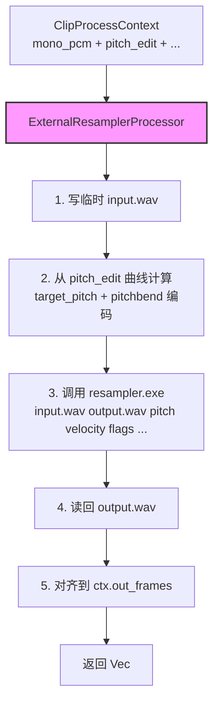
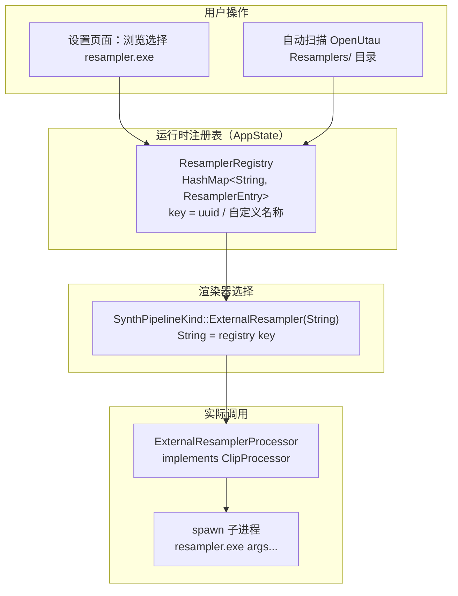
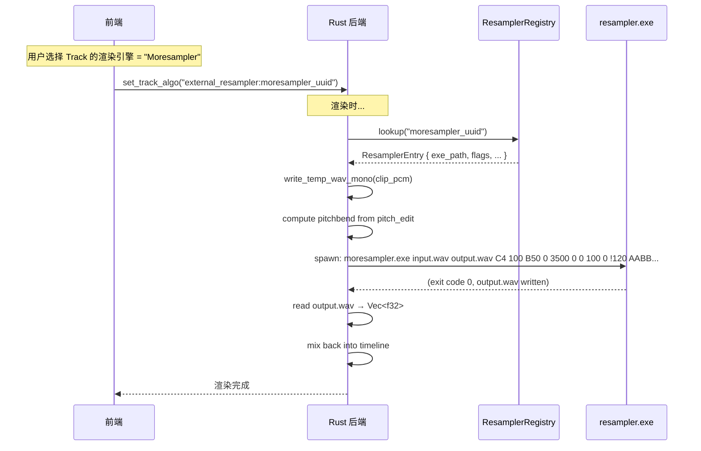

# 外部 Resampler 集成方案

> 设计文档 | HiFiShifter  
> 创建日期: 2026-03-10

## 一、需求概述

让 HiFiShifter 支持加载外部 UTAU Resampler（如 Moresampler、TIPS、straycat、tn_fnds 等），以类似 VslibProcessor 的模式做逐 clip 处理，然后读回做 mix。

**核心原则**：不把 resampler 写死在代码中，由用户自行注册外部 resampler 可执行文件。

## 二、架构总览

### 处理流程



### 动态注册架构



## 三、动态注册表设计

### 数据结构

```rust
/// 外部 Resampler 注册条目（持久化到用户配置）
#[derive(Debug, Clone, Serialize, Deserialize)]
pub struct ResamplerEntry {
    /// 唯一 ID（UUID 或用户自定义短名）
    pub id: String,
    /// 显示名称（如 "Moresampler"、"TIPS"、"tn_fnds"）
    pub display_name: String,
    /// 可执行文件绝对路径
    pub exe_path: PathBuf,
    /// 默认 flags 字符串（如 "B50Y0H0"）
    pub default_flags: String,
    /// 是否可用（exe 存在且可执行）
    pub available: bool,
}

/// 注册表（存在 AppState 中，持久化到 config.json）
pub struct ResamplerRegistry {
    pub entries: HashMap<String, ResamplerEntry>,
}
```

### 用户注册方式

1. **手动添加**：通过前端设置页面浏览文件系统选择 `.exe`，输入显示名称
2. **自动扫描**：扫描 OpenUtau 安装目录的 `Resamplers/` 子目录，自动发现可用 resampler
3. **移除/禁用**：从列表中删除或禁用

### SynthPipelineKind 枚举变更

```rust
pub enum SynthPipelineKind {
    WorldVocoder,
    NsfHifiganOnnx,
    #[cfg(feature = "vslib")]
    VocalShifterVslib,
    ExternalResampler(String),  // String = registry entry id
}
```

枚举携带 registry entry ID，`get_processor()` 通过 ID 查找注册表获取具体的 exe 路径和配置。

## 四、Resampler 接口调用协议（核心）

### 命令行参数规范

UTAU resampler 的标准命令行协议：

```
resampler.exe <in_file> <out_file> <pitch> <velocity> [flags] [offset] [length_require] [consonant] [blank] [volume] [modulation] [tempo] [pitchbend...]
```

### 参数详解

| # | 参数名 | 类型 | 说明 | HiFiShifter 中如何映射 |
|---|---|---|---|---|
| 1 | `in_file` | string | 输入 WAV 文件路径 | clip 的 mono PCM → 临时 WAV（16-bit，单声道） |
| 2 | `out_file` | string | 输出 WAV 文件路径 | 临时输出 WAV 路径 |
| 3 | `pitch` | string | 目标音高，**音名格式**如 `C4`、`A#3`、`Bb2` | 从 `pitch_edit` 曲线的中位/均值 MIDI → 音名转换 |
| 4 | `velocity` | int | 音量力度，0-200，默认 100 | 固定 `100`（或从 gain 映射） |
| 5 | `flags` | string | 引擎特殊标记，如 `B50g-5Mt` | 用户在 UI 中配置的 flags 字符串 |
| 6 | `offset` | float | 源音频起始偏移（ms） | `0`（clip 已经裁剪过） |
| 7 | `length_require` | float | 要求输出长度（ms） | `mono_pcm.len() / sample_rate / playback_rate * 1000`（源时长 ÷ playback_rate = timeline 时长）。等价于 `out_frames / sample_rate * 1000`，但显式体现 playback_rate 参与计算 |
| 8 | `consonant` | float | 辅音长度（ms） | `0`（非声库拼接模式） |
| 9 | `blank` | float | 空白/截断（ms）。负数 = 从末尾裁掉 | `0` |
| 10 | `volume` | int | 音量百分比（0-200） | `100`（或映射 clip gain） |
| 11 | `modulation` | int | 调制（0-200），控制原始音高的保留程度 | `0`（完全使用目标音高）或 `100`（保留原始特征） |
| 12 | `tempo` | string | BPM，格式 `!120` | 从 timeline BPM 取 |
| 13+ | `pitchbend...` | string | Base64 编码的逐帧音高弯曲曲线 | 从 `pitch_edit - target_pitch` 计算 cent 偏移 → 编码 |

### Pitch 参数（音名格式）转换

```
MIDI 60 → "C4"
MIDI 61 → "C#4"  
MIDI 69 → "A4"
MIDI 48 → "C3"
```

转换逻辑：

```rust
fn midi_to_utau_pitch(midi: f32) -> String {
    const NAMES: &[&str] = &["C", "C#", "D", "D#", "E", "F", "F#", "G", "G#", "A", "A#", "B"];
    let note = midi.round() as i32;
    let octave = (note / 12) - 1;  // MIDI 60 = C4, 60/12=5, 5-1=4
    let name_idx = (note % 12) as usize;
    format!("{}{}", NAMES[name_idx], octave)
}
```

### Pitchbend 编码（Base64，核心）

UTAU 的 pitchbend 使用自定义 Base64 编码的逐帧 cent 偏移值：

- **每个值**：12-bit 有符号整数，范围 `[-2048, +2047]`，单位 cent（相对于参数 3 的目标音高）
- **编码**：每个值用 2 个 Base64 字符表示（6bit + 6bit = 12bit）
- **Base64 字母表**：`ABCDEFGHIJKLMNOPQRSTUVWXYZabcdefghijklmnopqrstuvwxyz0123456789+/`
- **帧率**：由 tempo 参数隐式确定，约 `tempo * 96 / 60` Hz

```rust
/// UTAU 12-bit Base64 pitchbend 编码
fn encode_pitchbend(cent_offsets: &[i16]) -> String {
    const B64: &[u8; 64] = b"ABCDEFGHIJKLMNOPQRSTUVWXYZabcdefghijklmnopqrstuvwxyz0123456789+/";
    let mut result = String::with_capacity(cent_offsets.len() * 2);
    for &delta in cent_offsets {
        let val = (delta as i32).clamp(-2048, 2047);
        let unsigned = if val < 0 { (val + 4096) as u16 } else { val as u16 };
        result.push(B64[(unsigned >> 6) as usize] as char);
        result.push(B64[(unsigned & 0x3F) as usize] as char);
    }
    result
}
```

**从 `pitch_edit` 曲线 → pitchbend 的转换**：

```rust
// pitch_edit[i] = 绝对 MIDI 值 (如 69.5)
// target_pitch = 参数 3 的目标 MIDI (如 69.0, 即 A4)
// cent_offset = (pitch_edit[i] - target_pitch) * 100
let target_midi = median_pitch(pitch_edit);  // 取中位数作为 target
let cent_offsets: Vec<i16> = pitch_edit.iter()
    .map(|&midi| ((midi - target_midi) * 100.0).round().clamp(-2048.0, 2047.0) as i16)
    .collect();
let pitchbend_str = encode_pitchbend(&cent_offsets);
```

### 帧率对齐

UTAU pitchbend 的帧率由 tempo 决定（约 `tempo * 96 / 60` fps），而 HiFiShifter 的 `pitch_edit` 帧率由 `frame_period_ms` 决定（如 5ms = 200fps）。**需要做重采样对齐**。

## 五、ClipProcessor 实现

### ExternalResamplerProcessor 结构

```rust
pub struct ExternalResamplerProcessor {
    entry: ResamplerEntry,
}

impl ClipProcessor for ExternalResamplerProcessor {
    fn id(&self) -> &str { &self.entry.id }
    fn display_name(&self) -> &str { &self.entry.display_name }
    fn is_available(&self) -> bool { self.entry.exe_path.exists() }
    
    fn capabilities(&self) -> ProcessorCapabilities {
        ProcessorCapabilities {
            handles_time_stretch: true,  // 通过 length_require 控制
            supports_formant: false,      // 通过 flags 中的 g 参数间接支持
            supports_breathiness: false,  // 通过 flags 中的 B 参数间接支持
        }
    }
    
    fn param_descriptors(&self) -> Vec<ParamDescriptor> {
        // flags 字符串（用户可编辑）
        // modulation（0-200 滑块）
        // velocity（0-200 滑块）
        vec![/* ... */]
    }

    fn process(&self, ctx: &ClipProcessContext<'_>) -> Result<Vec<f32>, String> {
        // 1. 写临时 input.wav（同 vslib 的 write_temp_wav_mono）
        // 2. 准备临时 output.wav 路径
        // 3. 从 pitch_edit 计算 target_pitch + pitchbend
        // 4. 构造命令行参数
        // 5. spawn resampler.exe 子进程，等待完成
        // 6. 读回 output.wav → Vec<f32>
        // 7. 对齐到 ctx.out_frames（truncate / zero-pad）
        // 8. 清理临时文件（RAII guard）
    }
}
```

### process() 核心伪代码

```rust
fn process(&self, ctx: &ClipProcessContext) -> Result<Vec<f32>, String> {
    // 1. 写入临时 input WAV
    let input_wav = write_temp_wav_mono(ctx.mono_pcm, ctx.sample_rate)?;
    
    // 2. 准备输出路径
    let output_wav = temp_dir().join(format!("resampler_out_{}.wav", uuid()));
    
    // 3. 计算 target pitch（pitch_edit 中位数）
    let target_midi = median_pitch(ctx.pitch_edit);
    let pitch_str = midi_to_utau_pitch(target_midi);
    
    // 4. 计算 pitchbend（逐帧 cent 偏移 → Base64）
    let cent_offsets: Vec<i16> = ctx.pitch_edit.iter()
        .map(|&midi| ((midi - target_midi) * 100.0).round().clamp(-2048.0, 2047.0) as i16)
        .collect();
    // 重采样到 UTAU 帧率
    let resampled = resample_to_utau_framerate(&cent_offsets, ctx.frame_period_ms, ctx_bpm);
    let pitchbend_b64 = encode_pitchbend(&resampled);
    
    // 5. 计算输出长度（考虑 playback_rate）
    //    source_ms = 源音频时长（ms）
    //    length_require = source_ms / playback_rate = timeline 上的目标时长
    //    等价于 out_frames / sample_rate * 1000，但显式体现 playback_rate 参与计算，
    //    与 vslib 的 time2 = source_ms / playback_rate 逻辑一致。
    let source_ms = ctx.mono_pcm.len() as f64 / ctx.sample_rate as f64 * 1000.0;
    let length_ms = source_ms / ctx.playback_rate.max(1e-6);
    
    // 6. 构造命令行参数并调用
    let status = Command::new(&self.entry.exe_path)
        .args([
            input_wav.to_str().unwrap(),
            output_wav.to_str().unwrap(),
            &pitch_str,                     // 目标音高
            "100",                          // velocity
            &self.entry.default_flags,      // flags
            "0",                            // offset
            &format!("{:.1}", length_ms),   // length_require
            "0",                            // consonant
            "0",                            // blank
            "100",                          // volume
            "0",                            // modulation
            &format!("!{}", ctx_bpm),       // tempo
            &pitchbend_b64,                 // pitchbend
        ])
        .spawn()
        .map_err(|e| format!("Failed to spawn resampler: {}", e))?
        .wait()
        .map_err(|e| format!("Resampler process error: {}", e))?;
    
    if !status.success() {
        return Err(format!("Resampler exited with code: {:?}", status.code()));
    }
    
    // 7. 读回 output.wav → Vec<f32>
    let pcm = read_wav_mono(&output_wav)?;
    
    // 8. 对齐到 ctx.out_frames
    let mut out = vec![0.0f32; ctx.out_frames];
    let copy_len = pcm.len().min(ctx.out_frames);
    out[..copy_len].copy_from_slice(&pcm[..copy_len]);
    
    // 9. 清理临时文件
    let _ = std::fs::remove_file(&input_wav);
    let _ = std::fs::remove_file(&output_wav);
    
    Ok(out)
}
```

### 参数暴露（ParamDescriptor）

```rust
static RESAMPLER_PARAMS: &[ParamDescriptor] = &[
    ParamDescriptor {
        id: "resampler_flags",
        display_name: "Flags",
        group: "Resampler",
        kind: ParamKind::StaticEnum {
            options: &[
                ("Default", 0),
                ("Breathiness +50", 1),   // B50
                ("Gender -10", 2),         // g-10
            ],
            default_value: 0,
        },
    },
    ParamDescriptor {
        id: "resampler_gender",
        display_name: "Gender (Formant)",
        group: "Resampler",
        kind: ParamKind::AutomationCurve {
            unit: "",
            default_value: 0.0,
            min_value: -100.0,
            max_value: 100.0,
        },
    },
];
```

### 注册到 get_processor()

```rust
// renderer/mod.rs
pub fn get_processor(kind: SynthPipelineKind) -> Box<dyn ClipProcessor> {
    match kind {
        SynthPipelineKind::WorldVocoder => Box::new(chain::world_chain()),
        SynthPipelineKind::NsfHifiganOnnx => Box::new(chain::hifigan_chain()),
        #[cfg(feature = "vslib")]
        SynthPipelineKind::VocalShifterVslib => Box::new(vslib_processor::VslibProcessor),
        SynthPipelineKind::ExternalResampler(ref id) => {
            // 从 ResamplerRegistry 中查找 entry
            let entry = REGISTRY.lock().unwrap().get(id).cloned()
                .expect("Resampler not found in registry");
            Box::new(external_resampler::ExternalResamplerProcessor::new(entry))
        }
    }
}
```

## 六、调用流程全图



## 七、分段策略

### 策略 A：整段调用（推荐先做）

- 不分段，直接把整个 clip 作为一次 resampler 调用
- 把全部音高变化编码到 `pitchbend` 参数中
- **优点**：简单、无拼接接缝
- **缺点**：某些 resampler 可能不支持长 pitchbend 曲线

### 策略 B：按音高突变分段（降级方案）

- 将 pitch_edit 曲线按"音高突变"分割为多段
- 每段独立调用 resampler → crossfade 拼接
- **优点**：兼容性更好，短段处理更稳定
- **缺点**：需要处理段间 crossfade，可能有接缝

**推荐**：先实现策略 A，遇到兼容性问题再降级到策略 B。

## 八、与 VslibProcessor 的对比

| 维度 | VslibProcessor | ExternalResamplerProcessor |
|---|---|---|
| **外部依赖** | vslib DLL（FFI 调用） | 任意 resampler.exe（子进程） |
| **通信方式** | C FFI（函数调用） | 命令行参数 + WAV 文件 I/O |
| **音高编辑** | 逐控制点写入 pitEdit | pitchbend Base64 编码 |
| **时间拉伸** | `VslibAddTimeCtrlPnt`（`time2 = source_ms / rate`） | `length_require = source_ms / playback_rate`（ms） |
| **共振峰** | `formant` 控制点 | `g` flag |
| **临时文件** | 1 个 input WAV | 1 个 input + 1 个 output WAV |
| **平台限制** | Windows only | 跨平台（只要 resampler 有对应平台版本） |

## 九、文件变更清单

| 文件 | 操作 | 说明 |
|---|---|---|
| `renderer/external_resampler.rs` | **新建** | `ExternalResamplerProcessor` 实现 |
| `renderer/mod.rs` | 修改 | 注册新 processor |
| `state.rs` | 修改 | `SynthPipelineKind` 新增 `ExternalResampler(String)` 变体 |
| `state.rs` | 修改 | 新增 `ResamplerRegistry` + `ResamplerEntry` |
| 前端设置面板 | 修改 | 添加 resampler 管理页面（浏览/添加/移除 exe） |
| 前端引擎选择 | 修改 | 下拉列表动态展示已注册的 resampler |

## 十、风险与注意事项

1. **性能**：每次 process 需要 spawn 子进程 + 磁盘 I/O，比 FFI 慢很多。适合离线预渲染，不适合实时播放
2. **帧率对齐**：UTAU pitchbend 帧率（约 `tempo * 96 / 60` fps）与 HiFiShifter 的 `frame_period_ms` 不同，需要做重采样
3. **resampler 兼容性**：不同 resampler 对参数的解释略有差异（特别是 `flags`），flags 只做字符串传递，不在后端 parse
4. **临时文件清理**：使用与 vslib 相同的 RAII guard 模式确保 drop 时清理
5. **长 clip 的 pitchbend**：某些旧 resampler 可能不支持非常长的 pitchbend 字符串（通常 UTAU 音符只有几秒）
6. **错误处理**：需处理 resampler 崩溃/超时/输出空文件等边界情况

## 十一、待确认项

- [ ] 策略 A（整段调用 + pitchbend 编码）作为初始实现是否 OK？
- [ ] 是否需要支持多个 resampler 同时注册？（当前方案已支持）
- [ ] flags 参数是否需要 UI 层的预设机制，还是纯文本输入即可？
- [ ] modulation 参数的默认值：`0`（完全使用目标音高）vs `100`（保留原始特征）？
