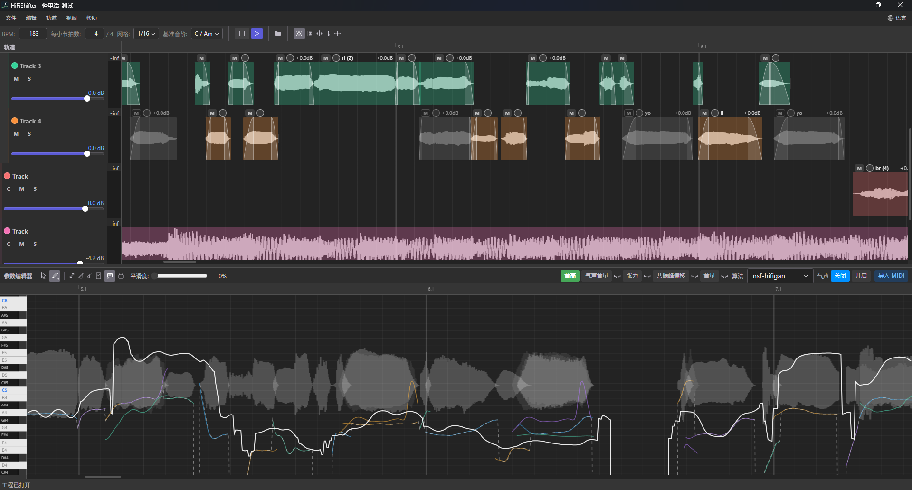

# HiFiShifter

[简体中文](../../README.md) | [繁體中文](README_zh-TW.md) | [English](README_en.md) | [日本語](README_ja.md) | [한국어](README_ko.md)

HiFiShifter는 그래픽 보컬 편집 및 합성 도구입니다. 멀티트랙 오디오 클립 처리를 지원하며, 트랙 그룹 단위로 여러 보코더를 사용하여 보컬의 피치 보정 및 파라미터 조정을 수행하여 Jinriki VOCALOID 제작의 편집과 튜닝을 통합합니다.

**이 프로젝트는 아직 개발 중입니다. 전체 체인 테스트가 완료되지 않았으므로 많은 버그나 불안정한 문제가 존재할 수 있습니다.**



## 주요 기능

- **트랙 편집**: DAW와 유사한 멀티트랙 타임라인. 클립 자르기, 스트레치, Slip, 페이드 인/아웃과 크로스페이드, 그룹화, 테이크 관리, 무음 감지, 리플 편집, 템포 맵(BPM / 박자표 / 스케일), 메트로놈과 녹음 등을 지원합니다.
- **파라미터 편집**: 트랙 그룹 단위로 피아노 롤 방식의 파라미터 에디터를 통해 피치, 볼륨, 다이내믹, 팬, 포먼트, 브레스, 텐션 등의 파라미터 라인을 조정합니다. 그리기 / 직선 / 비브라토 도구, 다중 선택 범위 편집과 비브라토 프리셋 관리를 지원하며, 하위 트랙에 `센트 차` / `도수 차` / `포먼트 차`를 더해 화성을 만들 수 있습니다.
- **세 가지 보코더 알고리즘**: nsf-hifigan(PC-NSF-HiFiGAN), World, VsLib. 자세한 내용은 [알고리즘](#알고리즘)을 참고하세요.
- **상호 운용성**: REAPER(`.rpp`)와 VocalShifter(`.vshp` / `.vsp`) 프로젝트 가져오기, REAPER·VocalShifter 클립보드 양방향 읽기/쓰기를 지원합니다. MIDI는 음높이 참조 블록 / 음높이 파라미터 / 템포 맵으로 가져올 수 있고, 오디오 클립과 피치 라인을 MIDI로 내보낼 수 있습니다.
- **가져오기 / 내보내기**: 일반적인 오디오 / 비디오 포맷 가져오기(비디오는 오디오 트랙 자동 추출), 프로젝트와 분리 트랙을 `wav` / `mp3` / `flac`으로 내보냅니다.
- **기타**: 내장 파일 브라우저와 빠른 검색, 노트, 자동 백업, 다국어 인터페이스(简体中文 / 繁體中文 / English / 日本語 / 한국어), 다크/라이트 테마, 추론 장치 선택과 벤치마크.

## 설치

[Releases](https://github.com/ARounder-183/HiFiShifter/releases) 페이지에서 운영체제와 아키텍처에 맞는 설치 패키지를 다운로드하세요:

- **Windows**: NSIS 설치 관리자(`installer`) 또는 포터블 ZIP(`portable`), x86_64와 arm64 아키텍처를 제공합니다.
- **macOS**: 서명되지 않은 dmg(Apple Silicon은 `arm64`, Intel은 `x86_64`). 첫 실행 시 수동으로 허용해야 합니다. "파일이 손상되었습니다"라는 메시지가 표시되면 [사용자 매뉴얼](USERMANUAL_ko.md#1-설치)의 절차에 따라 처리하세요.
- **Linux**: AppImage(x86_64 / arm64).

GPU 가속: Windows는 DirectML(DirectX 12), macOS(Apple Silicon)는 CoreML + WebGPU, Linux x86_64는 WebGPU(Dawn/Vulkan)를 사용하며, 그 외 플랫폼은 CPU로 폴백합니다. 앱 내 `옵션 → 추론 장치`에서 장치를 전환하고 벤치마크를 실행할 수 있습니다.

## 기본 원리

HiFiShifter는 UTAU와 유사한 오프라인 렌더링 방식을 사용하여 타임라인의 각 오디오 클립을 처리, 렌더링, 캐싱한 후 재생 시스템에 공급하므로 짧은 클립의 처리 효율이 높습니다.

HiFiShifter는 통합 렌더링 인터페이스를 제공하여 향후 알고리즘 추가를 용이하게 합니다.

## 권장 워크플로

권장 워크플로는 다음과 같습니다:

1. 다른 DAW 또는 슬라이싱 소프트웨어를 사용하여 인간 보컬에 필요한 짧은 클립 소스를 준비합니다.
2. HiFiShifter에서 오디오 스플라이싱 및 튜닝을 완료합니다.

물론 HiFiShifter는 다른 소프트웨어에서 프로젝트를 쉽게 마이그레이션할 수 있도록 다음 작업도 지원합니다:

1. VocalShifter 프로젝트를 직접 엽니다.
2. Reaper 프로젝트를 직접 엽니다.
3. VocalShifter 클립보드 내용을 구문 분석하여 VocalShifter의 파라미터를 HiFiShifter의 파라미터 영역에 붙여넣을 수 있습니다.
4. Reaper 클립보드 내용을 구문 분석하여 Reaper 항목을 HiFiShifter에 직접 붙여넣을 수 있습니다.

## UI 및 알고리즘

### 레이아웃

HiFiShifter는 크게 상단의 트랙 패널과 하단의 파라미터 패널로 나뉩니다. 트랙 패널은 오디오 클립의 편집과 배치를 담당하고, 파라미터 패널은 오디오에 대한 파라미터 조정을 담당합니다. 각 패널은 도킹, 플로팅, 재배치가 가능합니다(`보기 → 창 / 레이아웃`).

트랙은 중첩을 지원합니다. 트랙을 다른 트랙 아래로 드래그하면 트랙 그룹(루트 트랙 + 하위 트랙)이 됩니다. 트랙 그룹은 하나의 알고리즘과 한 세트의 파라미터 라인을 공유하며, 파라미터 라인은 위치에 따라 그룹 내 모든 오디오 클립에 적용됩니다. 파라미터를 조정하기 전에 트랙의 컴포즈 버튼 `C`를 먼저 눌러야 합니다.

### 알고리즘

현재 HiFiShifter는 세 가지 알고리즘으로 처리를 지원합니다:

- **World**: 오랜 역사를 가진 보코더입니다. `피치`, `볼륨`, `다이내믹`, `팬` 파라미터 편집을 지원합니다.
- **PC-NSF-HiFiGAN**(알고리즘 목록에는 `nsf-hifigan`으로 표시): OpenVPI가 오픈소스로 공개한 노래 특화 HiFi-GAN 보코더이며 기본 알고리즘입니다. `피치`, `포먼트 시프트`, `브레스 게인`, `텐션`, `볼륨`, `다이내믹`, `팬` 파라미터 편집을 지원합니다. 이 중 `브레스 게인`과 `텐션`은 `하모닉 분리` 스위치에 의존합니다. 스위치를 켜면 오디오 클립을 하모닉과 노이즈 두 부분으로 분리하며(hnsep 모델 사용), **추가 렌더링 비용이 발생합니다**(처음에는 각 클립마다 한 번씩 분리해야 하므로 느려질 수 있습니다). 끄면 분리를 전혀 수행하지 않고, 이 두 파라미터는 회색으로 비활성화되며 곡선은 보이지만 편집할 수 없고 합성에도 참여하지 않습니다.
- **VsLib**(알고리즘 목록에는 `vslib`로 표시): VocalShifter 공식 알고리즘 라이브러리입니다. `피치`, `포먼트 시프트`, `브레스`, `볼륨`, `다이내믹`, `팬`, `합성 모드` 파라미터 편집을 지원합니다. **Windows x86_64 버전에서만 사용할 수 있습니다**. 공식 DLL은 파일 I/O만 지원하므로 VocalShifter 본체에 비해 처리 시간이 더 오래 걸립니다.

트랙 패널과 파라미터 패널의 자세한 조작(페이드 편집, 스냅 설정, 비브라토 프리셋, 내보내기와 녹음 등)은 [사용자 매뉴얼](USERMANUAL_ko.md)을 참고하세요.

## 자주 쓰는 단축키

> 단축키는 앱 내 `옵션 → 키보드 단축키...`에서 변경할 수 있으며, 아래 표는 기본값입니다. macOS에서는 `Ctrl`이 `⌘`, `Alt`가 `⌥`에 해당합니다.

| 동작                           | 단축키 / 마우스                                       |
| :----------------------------- | :---------------------------------------------------- |
| 재생 / 일시 정지(시작 위치로 돌아가지 않음) | `Space`                                  |
| 재생 / 정지(시작 위치로 돌아감) | `Enter`                                              |
| 메트로놈 켜기/끄기             | `K`                                                   |
| 뷰 이동                        | 마우스 휠 버튼(가운데 버튼) 드래그                    |
| 타임라인 스크롤                | 마우스 휠(2축 자유 스크롤)                            |
| 가로 / 세로 스크롤             | `Shift` / `Alt` + 마우스 휠                           |
| 트랙 높이 줌                   | `Ctrl` + 마우스 휠                                    |
| 실행 취소 / 다시 실행          | `Ctrl + Z` / `Ctrl + Shift + Z`(또는 `Ctrl + Y`)      |
| 잘라내기 / 복사 / 붙여넣기     | `Ctrl + X` / `Ctrl + C` / `Ctrl + V`                  |
| 선택한 클립 삭제               | `Delete`                                              |
| 재생 위치에서 분할             | `S`                                                   |
| 그룹화 / 그룹 해제             | `G` / `U`                                             |
| 테이크 순환 전환               | `T`(`Shift + T` 로 이전 테이크)                       |
| 범위 선택(다중 선택)           | 타임라인 빈 곳에서 마우스 오른쪽 버튼을 누른 채 드래그 |
| 복사 드래그                    | `Ctrl`을 누른 채 클립 드래그                          |
| 스트레치 / Slip 편집           | `Alt`를 누른 채 클립 가장자리 / 본체 드래그           |
| 스냅 일시 전환                 | `Shift`를 누른 채 드래그                              |
| 새 프로젝트 / 프로젝트 열기    | `Ctrl + N` / `Ctrl + Shift + O`                       |
| 미디어 파일 가져오기 / 오디오 내보내기 | `Ctrl + O` / `Ctrl + E`                       |
| 저장 / 다른 이름으로 저장      | `Ctrl + S` / `Ctrl + Shift + S`                       |
| 트랙 추가 / 녹음               | `Ctrl + T` / `Ctrl + R`                               |
| 모드 전환(선택 ↔ 그리기 도구)  | `Tab`                                                 |
| 빠른 검색                      | `Ctrl + F`                                            |
| 파라미터 라인 전체 위 / 아래로 이동 | `=` / `-`(선택 범위는 `[` / `]`), `Shift` 큰 폭, `Ctrl` 미세 |
| 파라미터 에디터 다중 선택 범위 | `Ctrl`을 누른 채 드래그로 범위 추가, 기존 범위 클릭으로 해제 |

전체 단축키와 수정 키 목록은 [사용자 매뉴얼](USERMANUAL_ko.md#3-트랙-인터페이스) 또는 앱 내 키보드 단축키 설정을 참고하세요.

## 개발

이 섹션은 개발자를 위한 것입니다. 일반 사용자는 건너뛸 수 있습니다.

### 1. 리포지토리 클론

```bash
git clone https://github.com/ARounder-183/HiFiShifter.git
cd HiFiShifter
```

### 2. 종속성 설치

#### Windows

다음 도구가 설치되어 있는지 확인하십시오:

- **Node.js** (권장 20+, CI는 24) 및 npm
- **Rust 툴체인** (`rust-toolchain.toml` 참조)
- **Tauri 2 CLI**: `cargo install tauri-cli --version "^2"`
- **CMake** (SoundTouch 라이브러리 빌드에 필요)

ONNX Runtime (DirectML)은 ort crate가 빌드 시 자동으로 다운로드하므로 추가 설정이 필요하지 않습니다.

`scripts/install_deps_windows.ps1` 스크립트를 실행할 수도 있습니다. Chocolatey로 NSIS / CMake / LLVM을 설치한 뒤 tauri-cli를 설치합니다(Chocolatey가 미리 설치되어 있어야 합니다).

프론트엔드 종속성 설치:

```bash
npm --prefix frontend install
```

#### macOS

```bash
chmod +x ./scripts/install_deps_macos.sh
SKIP_FRONTEND=0 bash ./scripts/install_deps_macos.sh
```

#### Linux

다음 도구가 설치되어 있는지 확인하세요:

- **Node.js** (권장 20+, CI는 24) 및 npm
- **Rust 툴체인** (`rust-toolchain.toml` 참조 — 프로젝트가 자동으로 플랫폼에 맞는 stable 툴체인을 선택합니다)
- **Tauri 2 CLI**: `cargo install tauri-cli --version "^2"`
- **CMake**, **pkg-config** 및 시스템 빌드 도구
- **GTK3, WebKit2GTK, ALSA** 등 Tauri 런타임 개발 라이브러리 (아래 설치 스크립트 참조)

원클릭 설치 스크립트 실행:

```bash
chmod +x ./scripts/install_deps_linux.sh
bash ./scripts/install_deps_linux.sh
```

이 스크립트는 시스템 종속성, Node.js(없는 경우), appimagetool 및 프론트엔드 npm 종속성을 설치합니다.

프론트엔드 종속성 설치 (스크립트를 사용하지 않는 경우):

```bash
npm --prefix frontend ci
```

### 3. 서드파티 소스

SoundTouch, WORLD, Signalsmith Stretch는 모두 컴파일 시점에 소스에서 빌드되며, 첫 빌드 때 **자동으로 클론**되므로 수동 작업이 필요하지 않습니다.

오프라인 빌드를 위해 미리 수동으로 클론할 수 있습니다. 예를 들어 SoundTouch:

```bash
cd backend/src-tauri/third_party/soundtouch-static
git clone --depth 1 --branch 2.3.3 https://codeberg.org/soundtouch/soundtouch.git soundtouch
```

### 4. 개발 및 빌드

```bash
# 개발 모드 (핫 리로드)
cd backend
cargo tauri dev

# 릴리스 빌드
# Windows / macOS (기본 features: onnx + vslib)
cargo tauri build

# Linux AppImage (vslib은 Windows 전용이므로 기본 feature 제외)
cargo tauri build --bundles appimage -- --no-default-features --features onnx
# 또는 보조 스크립트 사용: bash scripts/build-linux-appimage.sh

# Windows 포터블 ZIP
.\scripts\pack-portable.ps1 -SkipBuild
```

`TAURI_UI_MODE` 환경 변수로 프론트엔드 시작 모드를 전환할 수 있습니다:

- `dev`: 개발 모드(기본값, Vite dev server 사용, 핫 리로드 지원)
- `build`: 빌드 모드(프론트엔드 정적 자산을 먼저 빌드한 뒤 시작)

Linux/macOS (bash/zsh):

```bash
cd backend
TAURI_UI_MODE=build cargo tauri dev
```

Windows PowerShell:

```powershell
cd backend
$env:TAURI_UI_MODE='build'; cargo tauri dev
```

**참고:** 첫 빌드는 시간이 오래 걸리므로 기다려 주십시오.

### 5. GPU 가속

HiFiShifter는 지원되는 플랫폼에서 자동으로 GPU 추론 가속을 활성화합니다. 메뉴 표시줄의 **추론 장치(Inference Device)**에서 Auto / CPU / GPU를 선택할 수 있으며, **벤치마크 실행(Run Benchmark)**으로 각 장치의 추론 지연 시간을 비교할 수 있습니다.

| 플랫폼                          | GPU 기술                              | 설명                                                                              |
| ------------------------------- | ------------------------------------- | --------------------------------------------------------------------------------- |
| Windows x86_64 / ARM64          | DirectML (DirectX 12)                 | 검증된 안정적인 GPU 경로, NVIDIA / AMD / Intel Arc 지원                           |
| macOS ARM64 (Apple Silicon)     | CoreML + WebGPU (Dawn/Metal)          | CoreML은 Apple Neural Engine을 활용, WebGPU는 보조 GPU 백엔드로 사용 가능         |
| macOS x86_64 (Intel)            | —                                     | CPU only (ort-tract 대체 백엔드 사용)                                             |
| Linux x86_64                    | WebGPU (Dawn/Vulkan)                  | Dawn이 Vulkan API를 통해 GPU에 접근, GPU가 없으면 CPU로 폴백                      |
| Linux ARM64                     | —                                     | CPU only (이 타겟용 WebGPU ONNX Runtime 사전 빌드 바이너리가 없음)                |

> **참고**: Windows에서는 WebGPU가 아직 활성화되지 않았습니다. Dawn/D3D12 백엔드가 일부 GPU/드라이버 조합에서 네이티브 크래시를 일으킬 수 있습니다. DirectML이 Windows의 검증된 안정적인 GPU 경로입니다.

ONNX Runtime 바이너리는 ort crate의 `download-binaries` 기능으로 빌드 시 자동 다운로드되며, 수동 설치가 필요하지 않습니다. GPU 제공자(DirectML / WebGPU / CoreML) 코드는 대상 플랫폼에 따라 컴파일 시 자동으로 활성화되므로 추가 `--features` 플래그가 필요하지 않습니다.

**WSL2 사용자**:

- WSL2는 Linux 하위 환경에 하드웨어 Vulkan을 노출하지 않습니다. WebGPU/Dawn은 Lavapipe(CPU 소프트웨어 렌더링)만 사용할 수 있어 성능이 매우 나쁩니다. GPU 가속이 필요하면 Windows 네이티브 버전(DirectML)을 사용하세요.
- FUSE 지원이 없어 Tauri bundler의 linuxdeploy 단계가 실패할 수 있습니다(오류: `failed to run linuxdeploy`). 이는 WSL2의 알려진 제한 사항이며 실제 AppImage 출력에는 영향을 주지 않습니다 — AppDir은 `target/release/bundle/appimage/`에 올바르게 조립됩니다. `APPIMAGE_EXTRACT_AND_RUN=1`을 설정한 뒤 `appimagetool`을 수동으로 실행하여 패키징할 수 있습니다. 실제 Linux 머신이나 CI에서는 이 문제가 발생하지 않습니다.

## 로그 및 문제 해결

앱은 실행 로그를 OS 표준 로그 디렉터리에 자동으로 기록합니다. 명령줄 인수가 필요하지 않습니다:

| OS | 로그 디렉터리 |
| --- | --- |
| Windows | `%LOCALAPPDATA%\com.arounder.hifishifter\logs` |
| macOS | `~/Library/Logs/com.arounder.hifishifter` |
| Linux | `~/.local/share/com.arounder.hifishifter/logs` |

- 앱 내부의 **도움말 → 로그 폴더 열기** 메뉴로 로그 위치를 바로 열 수 있고, **도움말 → 진단 정보 내보내기...** 메뉴로 시스템 정보 + 전체 로그 + 추론 장치 벤치마크 결과가 담긴 진단 패키지를 한 번에 생성할 수 있습니다. 이슈 등록 시 첨부해 주세요.
- 로그는 크기 기준으로 자동 순환됩니다: 파일당 최대 8 MiB, 최대 3개의 이전 파일 보관 (`hifishifter.1.log` ~ `hifishifter.3.log`).
  - 반복되는 오류 / 경고는 자동으로 스로틀링됩니다: 동일한 위치의 로그는 10초 창당 최대 1건만 출력되며, 억제된 건수는 다음 출력 전에 `[throttled]` 행으로 보완 기록됩니다.
- 프론트엔드와 백엔드 오류가 모두 동일한 로그 파일에 기록되어 하나의 파일로 시간순 추적이 가능합니다.

고급 옵션:

- 실행 인수 `--log-file=<path>`: 로그를 지정한 경로에 기록합니다. `--log-file=-` 은 파일 로그를 명시적으로 비활성화합니다.
- 환경 변수 `HIFISHIFTER_LOG=debug` (또는 `trace` / `info` / `warn` / `error`): 로그 상세 수준을 조정합니다.
- 환경 변수 `HIFISHIFTER_LOG_DIR`: 기본 로그 디렉터리를 대체합니다.
- 터미널에서 `HiFiShifter --benchmark` 실행: 추론 장치 벤치마크를 실행하고 JSON 결과를 출력합니다.

## 문서

- 사용자 매뉴얼: [简体中文](../../docs/i18n/USERMANUAL.md) · [繁體中文](USERMANUAL_zh-TW.md) · [English](USERMANUAL_en.md) · [日本語](USERMANUAL_ja.md) · [한국어](USERMANUAL_ko.md)
- 확장(Extension) API: [docs/extension-api.md](../../docs/extension-api.md)
- UI 문구 스타일 가이드(i18n Style Guide): [docs/i18n/style-guide.md](../../docs/i18n/style-guide.md)

## 감사의 말

이 프로젝트는 다음 오픈 소스 라이브러리의 코드 또는 모델 아키텍처를 사용합니다:

- [WORLD](https://github.com/mmorise/World) - 고품질 음성 분석 및 합성 시스템
- [SoundTouch](https://www.surina.net/soundtouch/) - 오디오 타임 스트레치 및 피치 시프트 라이브러리 (LGPL)
- [Signalsmith Stretch](https://github.com/Signalsmith-Audio/signalsmith-stretch) - 고품질 오디오 타임 스트레치 라이브러리 (MIT)
- [VocalShifter Library (vslib)](https://ackiesound.ifdef.jp/) - 음성 분석 및 합성 라이브러리
- [SingingVocoders](https://github.com/openvpi/SingingVocoders) - 노래 합성 보코더 (OpenVPI)
- [HiFi-GAN](https://github.com/jik876/hifi-gan) - 고충실도 GAN 보코더
- [vocal-remover (hnsep)](https://github.com/stakira/vocal-remover) - 하모닉 / 노이즈 분리 모델(하모닉 분리에 사용)

## 라이선스

이 프로젝트는 [MIT 라이선스](../../LICENSE)에 따라 배포됩니다.
